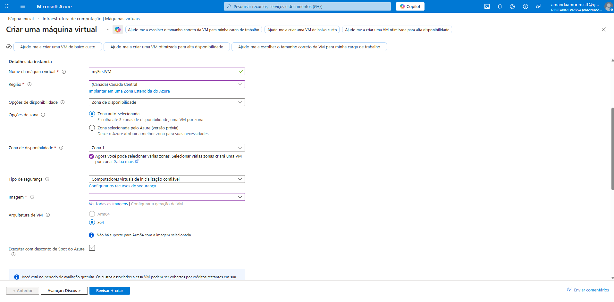
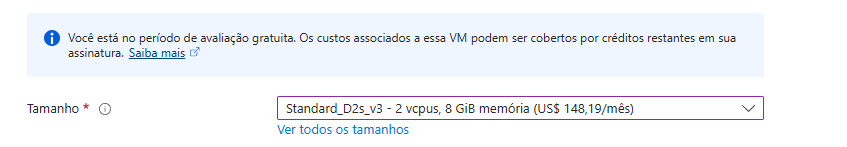
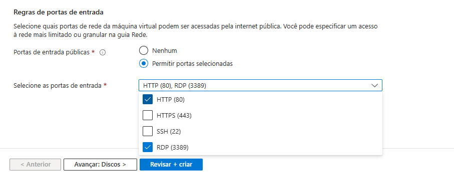
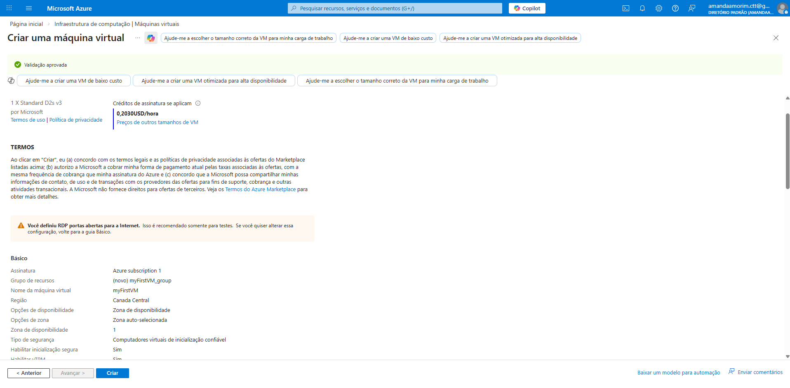
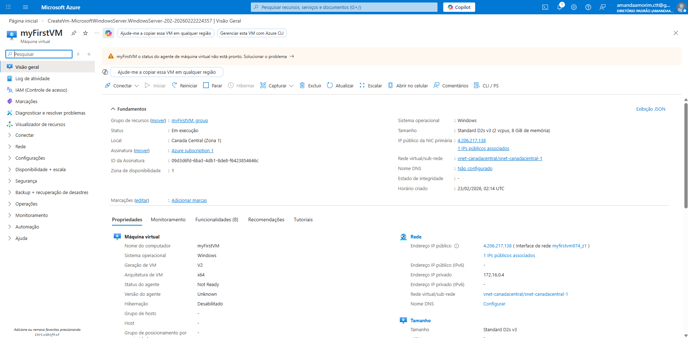

# Criando sua Primeira VM na Azure (2026)

## Introdução

Este guia fornece um passo a passo para criar uma máquina virtual na plataforma Microsoft Azure. São apenas 10 passos até sua primeira VM!

## Pré-requisitos

- Conta ativa na Azure
- Acesso ao Portal Azure
- Permissões suficientes para criar recursos

## Passos para Criar uma VM

1. Navegue para [portal.azure.com](https://portal.azure.com) e faça login com suas credenciais

2. Digite `máquinas virtuais` na barra de pesquisa

3. Em **Serviços**, selecione a opção **Máquinas virtuais**

4. Na página "*Infraestrutura de computação | Máquinas virtuais*", clique em **Criar** e selecione **Máquina virtual**

5. Em **Detalhes da instância**:
    * Escolha o **Nome da máquina virtual** da sua preferência (Sugestão `myFirstVM`)
    * Em **Imagem**, selecione _Windows Server 2025 Datacenter: Azure Edition - x64 Gen 2_

> Se você optar por selecionar "Executar com desconto de Spot do Azure", terá desconto na VM, porém disponibilidade limitada. Selecione (i) para mais detalhes.

6. Selecione o **Tamanho** da sua máquina. 

> O tamanho escolhido determina fatores como capacidade de processamento, memória e capacidade de armazenamento.
>
> As **opções disponíveis e valores podem variar** de acordo com a **Zona de disponibilidade** escolhida.

7. Em **Conta de administrador**, forneça um usuário como `azureuser` e uma senha, conforme o requisito de complexidade definido.

8. Em **Regras de porta de entrada**, escolha **Permitir portas selecionadas** e, em seguida, selecione RDP (3389) e HTTP (80) na lista suspensa.

9. Deixe os padrões restantes e clique em **Revisar + criar**

10. Após passar na validação, você terá o resumo da sua VM e valor/hora total. Clique em criar.

## Próximos Passos

Após criar a VM, você pode:

- Conectar via RDP (Windows) ou SSH (Linux)
- Instalar aplicações necessárias
- Configurar backups
- Monitorar performance

## Quando terminar, exclua!

Para não consumir seus créditos ou gerar gastos, exclua sua VM e recursos associados ao fim do laboratório. 

Na página inicial você pode acompanhar seus créditos disponíveis.