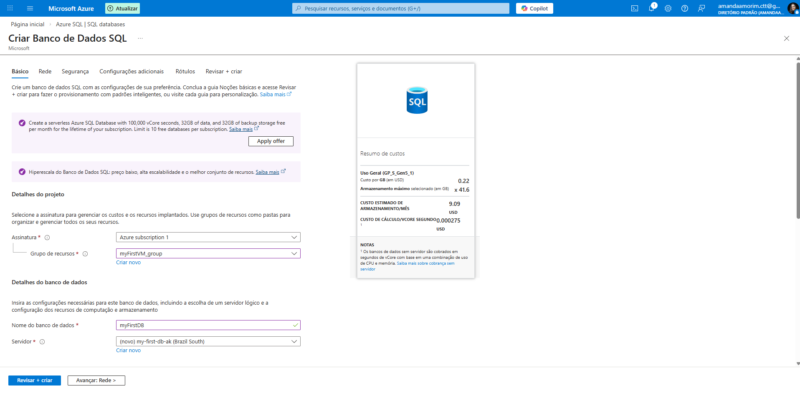
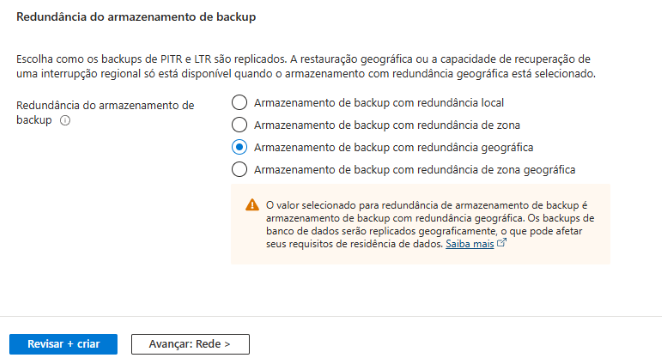
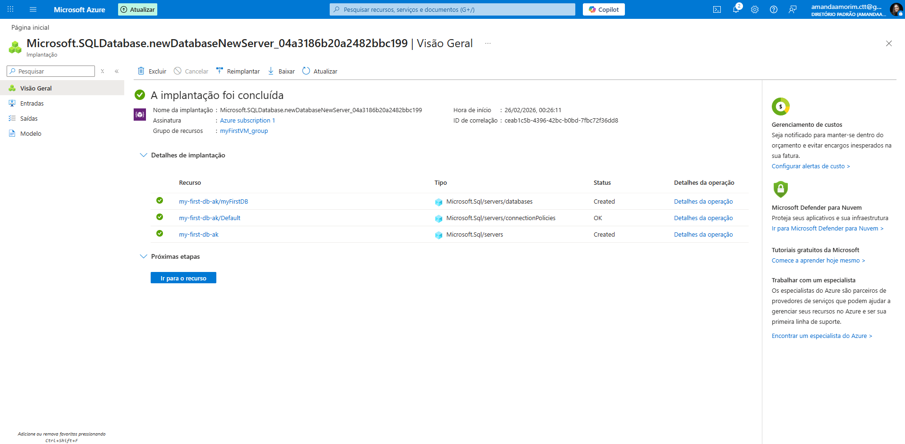

# Criando o Primeiro Banco de Dados SQL no Azure (2026)

> 💡 O Banco de Dados SQL do Azure é um serviço PaaS: você gerencia apenas o banco, não o sistema operacional nem o servidor físico.

## Introdução 
Este guia fornece um passo a passo para criar um banco de dados na plataforma Microsoft Azure.

## Pré-requisitos

- Conta Azure ativa
- Permissões para criar recursos
- Portal Azure ou Azure CLI configurado

## Passos para Criar um Banco de Dados SQL

1. Navegue para [portal.azure.com](https://portal.azure.com) e faça login com suas credenciais

2. Digite `banco de dados sql` na barra de pesquisa

3. Em **Serviços**, selecione a opção **Banco de Dados SQL do Azure**

4. Na página "*Azure SQL | SQL databases*", clique em **Criar** e selecione **banco de dados SQL**

5. Em **Detalhes do banco de dados**:
    * Escolha o **Nome do banco de dados** da sua preferência (Sugestão `myFirstDB`)
    * Em **Servidor**, selecione um pré-existente ou crie um novo.

6. Selecione a redundância desejada, deixe os padrões restantes e clique em **Revisar + criar**

      As redundâncias disponíveis são réplicas `LSR`(mesma região, um datacenter), `ZRS`(zonas diferentes na mesma região), `GRS`(região primária + região pareada) e `ZGRS`(zonas na região primária + região pareada).

## Próximos Passos

Após criar a DB, você pode:

- Conectar ao banco (SSMS ou aplicação)
- Criar tabelas e dados
- Configurar firewall / Private Endpoint
- Criar usuários e permissões
- Monitorar performance e custo
- Entre outros.

## Ao terminar, exclua!

Para evitar custos e consumo de créditos, exclua o DB ao fim do laboratório. A exclusão pode demorar um pouco, atualize a página para se certificar.

> Na página inicial você pode acompanhar seus créditos disponíveis.

## Referências
- Vídeo aula DIO
- [Portal Azure](https://portal.azure.com)
